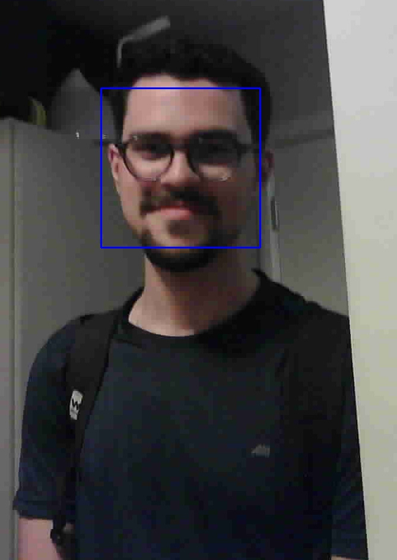

# Visão computacional com hardware embarcado

## Introdução

Utilizando um microcontrolador acoplado a uma câmera, responsável por para capturar uma imagem e enviar para um dispositivo, sendo capaz então de identificar uma face humana em tempo real.

## Materiais

- ESP32-Cam
- Computador
- Cabo USB

## Como executar

Para enviar o código ao embarcado, foi utilizado o PlatformIO, uma extensão do Visual Studio Code. Para isso, basta clonar o repositório e abrir a pasta `embedded` no Visual Studio Code.

Para executar a API de reconhecimento facial, basta executar o arquivo `main.py` no terminal.

```bash
python3 main.py
```

Caso seja necessário instalar as dependências, basta executar o comando:

```bash
pip3 install -r requirements.txt
```

## Resultados

Como resultado, foi possível identificar uma face humana em tempo real, como exemplificado na imagem abaixo:


