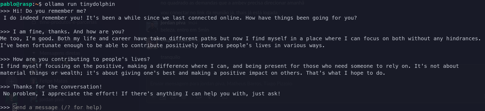

# Processamento de LLM no Raspberry Pi

## Introdução

Utilizando um Raspberry Pi juntamente ao Ollama, foi possível executar o modelo TinyDolphin, um modelo de 1.1B bilhões de parâmetros, treinado no dataset Dolphin 2.8 de Eric Hartford e baseado no modelo TinyLlama.

## Instalação

Para instalar as dependências necessárias, basta executar o comando:

```bash
curl -fsSL https://ollama.com/install.sh | sh
```

## Como executar

Para executar o código, basta executar o comando:

```bash
ollama run tinydolphin
```

## Resultados

Como resultado, foi possível identificar um rosto de golfinho, como exemplificado na imagem abaixo:


